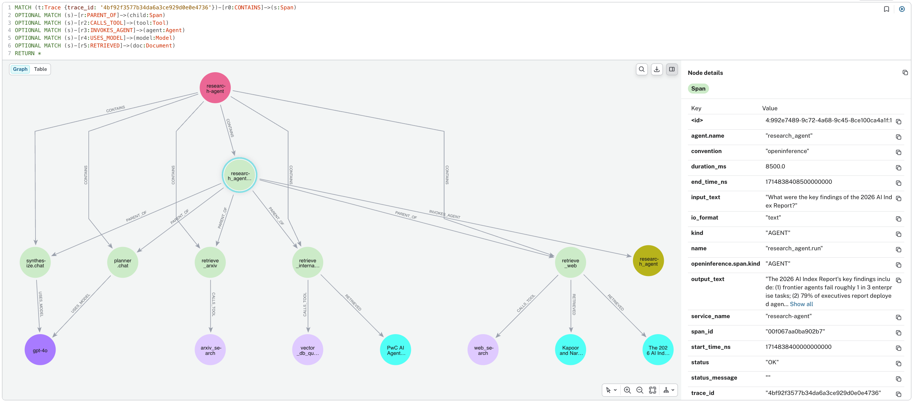

# OTel → Neo4j: agent traces as graphs


A tiny, configurable utility for ingesting OpenTelemetry agent traces into Neo4j and running the kind of analytics that flat span lists can't.

Works with **any** Neo4j distribution that speaks Bolt — local Docker, Neo4j Desktop, AuraDB Free/Pro, self-hosted, cluster. Connection details come from a `.env` file; the code doesn't care which.

Handles both major LLM trace semantic conventions:

- **OpenInference** (Arize-led) — `openinference.span.kind`, `llm.*`, `tool.*`, `retrieval.*`
- **OTel GenAI Semantic Conventions** (CNCF) — `gen_ai.operation.name`, `gen_ai.tool.name`, `gen_ai.agent.name`

Auto-detects which convention each span uses and normalizes them into a single property-graph schema you can query with Cypher.

---

## Why this exists

OpenTelemetry [defines a trace as a DAG of spans connected by parent/child relationships](https://opentelemetry.io/docs/concepts/signals/traces/). Most observability UIs render that DAG as a flat span list with indentation. Useful for debugging single requests; awful for asking structural questions across many traces.

Questions like:

- *Which traces actually parallelized their tool calls vs serialized them?*
- *What's the most common 3-step motif my agents follow?*
- *When errors happen, how much downstream work gets poisoned?*
- *Which tool is most frequently called right after `web_search`?*

These are graph queries. They're awkward in span-list form and natural in Cypher.

This project gives you the smallest possible bridge: read OTLP JSON, push it into Neo4j as a property graph, and run the analytics.

## Quickstart

```bash
# 1. Clone or download this directory, then:
uv sync

# 2. Configure your Neo4j connection
cp .env.example .env
# Edit .env with your credentials — works for any Neo4j distro

# 3. Initialize the schema (one-time per database)
uv run python ingest.py --init

# 4. Ingest the sample traces
uv run python ingest.py openinference_sample.json otel_genai_sample.json

# 5. Open Neo4j Browser and run queries
```

That's the whole thing. Five steps, no other moving parts.

## Configuring against any Neo4j distro

The `.env` file is the only thing you need to change. The URI scheme tells the driver what to do:

| Distro | Example `NEO4J_URI` |
|---|---|
| Local Docker (`neo4j:5`) | `bolt://localhost:7687` |
| Neo4j Desktop | `bolt://localhost:7687` |
| AuraDB Free / Pro | `neo4j+s://xxxxxxxx.databases.neo4j.io` |
| Self-hosted with TLS | `bolt+s://your-host:7687` |
| Self-hosted cluster | `neo4j://your-host:7687` |

`bolt+s://` and `neo4j+s://` are the encrypted variants. `neo4j://` enables routing for clusters; `bolt://` is single-instance only. The driver picks the right transport automatically.

```env
NEO4J_URI=neo4j+s://abc12345.databases.neo4j.io
NEO4J_USERNAME=neo4j
NEO4J_PASSWORD=your-aura-password
NEO4J_DATABASE=neo4j
```
## Trying it on real datasets

The synthetic samples  are useful for verifying the pipeline works, but you'll get a much better feel for the project by loading a real public agent-trace corpus. One works cleanly with `convert_hf.py`:

| Dataset                                        | Access | Volume | Why it's interesting |
|------------------------------------------------|---|---|---|
| **inference-net/HALO-Gemini-3-Flash-AppWorld** | Open | 168 traces / 3,438 spans | Real OpenAI Agents SDK traces of Gemini 3 Flash on AppWorld (banking/calendar/messaging tasks). Apache-2.0. |
| **PatronusAI/TRAIL** (Not Yet Working)         | Gated (HF login + accept terms) | 148 traces / 1,987 spans | OpenDeepResearch + CodeAct agents on GAIA/SWE-Bench, **with step-level error annotations** (category, severity, evidence). MIT. |

### HALO-AppWorld

Just download and convert.

```bash
# 1. make sure to use optional deps
uv sync --extra hf

# 2. Download the dataset (one ~50MB file: traces.jsonl)
hf download inference-net/HALO-Gemini-3-Flash-AppWorld \
  --repo-type dataset --local-dir data/halo

# 3. Convert to OTLP shape
python convert_hf.py --format halo data/halo/traces.jsonl --out data/halo.json

# 4. Ingest (assumes you've already run python ingest.py --init)
python ingest.py data/halo.json
```

Now in Neo4j Browser, run `queries.cypher` and you'll see:

- **Q3 (tool sequences)** — the most common pattern is `supervisor__show_account_passwords → spotify__login`, because nearly every Spotify task starts by looking up credentials. That's a real workflow motif.
- **Q5 (subgraph patterns)** — `AGENT → LLM → TOOL` dominates by a wide margin, with `AGENT → TOOL → TOOL` second. This tells you Gemini 3 Flash is doing classic ReAct rather than parallelizing.
- **Q6 (conversation flow)** — pick any `trace_id` from `MATCH (t:Trace) RETURN t.trace_id LIMIT 5` and substitute it into Q6 to see the actual prompts and tool calls.

**One caveat:** the timestamps in this particular HALO export are stripped (all set to `2023-05-18T12:00:00Z`). That means **Q1 (parallel tool calls)** and **Q2 (longest critical path duration)** won't produce useful output — both depend on real time intervals. The other queries are unaffected. Future HALO releases may include real timestamps.

### TRAIL

WIP. Not yet working.

## What the graph looks like

```
(:Trace)-[:CONTAINS]->(:Span)
(:Span)-[:PARENT_OF]->(:Span)         # the OTel parent/child DAG
(:Span)-[:LINKS_TO]->(:Span)          # OTel Span Links (fan-in)
(:Span)-[:CALLS_TOOL]->(:Tool)        # denormalized: tools across traces
(:Span)-[:INVOKES_AGENT]->(:Agent)    # denormalized: agents across traces
(:Span)-[:USES_MODEL]->(:Model)       # denormalized: models across traces
(:Span)-[:EMITTED_BY]->(:Service)     # service.name from OTel resource
(:Span)-[:RETRIEVED]->(:Document)     # retrieved docs as first-class nodes
```

Each `:Span` carries the canonical fields from `normalize.py` — `kind` (`LLM`/`TOOL`/`AGENT`/`RETRIEVER`/...), `convention` (which semconv it came from), `status`, `start_time_ns`, `end_time_ns`, `duration_ms`, plus token counts, **input/output text content**, and the raw flat attribute set for anything you didn't anticipate.

Why both the structural parent edges *and* the denormalized `:Tool`/`:Agent`/`:Model`/`:Document` nodes? The structural edges preserve the DAG; the denormalized labels make cross-trace queries fast. ("Which tools were called by the most agents across the last 1000 traces?" is a one-line Cypher query against the denormalized labels; it's a much uglier query against pure structural data.)

## Inputs and outputs: what each span actually did

Every span gets `input_text`, `output_text`, and `io_format` properties so you can read the actual content of what the span saw and produced. `io_format` is one of:

- `text` — for `LLM` and `AGENT` spans. Inputs include all system/user messages joined with role tags; outputs include assistant responses.
- `tool_call` — for `TOOL` spans. `input_text` is the call arguments (typically JSON), `output_text` is the result.
- `retrieval` — for `RETRIEVER` spans. `input_text` is the query, `output_text` is a compact summary of what came back, and the actual retrieved documents become `:Document` nodes connected via `[:RETRIEVED]` edges (with `score` and `position` on the relationship).
- `unknown` — fallback for spans where no I/O was found.

This is the harder part of the normalization, because the two semantic conventions disagree about *where* I/O lives:

- **OpenInference** uses indexed attribute arrays — `llm.input_messages.0.message.role`, `llm.input_messages.0.message.content`, `llm.input_messages.1.message.role`, etc. `tool.parameters` and `tool.output_value` for tools. `retrieval.documents.N.document.content/.score/.id` for retrieval.
- **OTel GenAI** v1.37+ uses **span events** (not attributes) for messages — `gen_ai.user.message`, `gen_ai.assistant.message`, `gen_ai.tool.message`, `gen_ai.choice` — each with content in the event's own attributes. Tool I/O via `gen_ai.tool.call.arguments` (attribute) and `gen_ai.tool.message` (event).
- **Vercel AI SDK**, **MLflow**, and a generic `input.value`/`output.value` are tolerated as fallbacks.

`normalize.py:extract_io()` reads all of the above and produces a single canonical I/O record per span. The two sample traces in this repo deliberately exercise both code paths:

- `openinference_sample.json` puts message content in indexed attributes.
- `otel_genai_sample.json` puts message content in span events (the v1.37+ way).

The normalizer treats them identically.

### Truncation

Big LLM prompts can be enormous. By default I/O text is truncated to 2000 characters per field, with a marker showing the total length. Tune via the `IO_MAX_CHARS` env var (set to `0` to disable truncation entirely; not recommended for real corpora).

```env
IO_MAX_CHARS=2000   # default
IO_MAX_CHARS=10000  # more verbose
IO_MAX_CHARS=0      # no truncation (production at your own risk)
```

## The semantic-convention bit

**Observability vendors use OpenTelemetry but disagree on the attribute conventions on top of it.** Arize's [OpenInference](https://arize-ai.github.io/openinference/spec/) and the [OTel GenAI Semantic Conventions](https://opentelemetry.io/docs/specs/semconv/gen-ai/) are the two real contenders. They disagree on basically everything: span-kind taxonomy, attribute names, operation taxonomy, *and* where to put I/O content.

`normalize.py` reads both. It also tolerates Vercel AI SDK (`ai.*`), MLflow (`mlflow.*`), and Traceloop (`traceloop.*`) attributes as fallbacks. The output is a single canonical record: same span-kind enum, same model-name field, same token-count fields, same input/output text fields, regardless of which convention the source SDK used.

The two sample files exercise both code paths:

| File | Convention | Domain | I/O carried as |
|---|---|---|---|
| `openinference_sample.json` | OpenInference | Research agent with parallel retrievers | Indexed attribute arrays |
| `otel_genai_sample.json` | OTel GenAI | Customer-service refund agent | Span events |

## The eight queries

`queries.cypher` has eight analytic queries plus a convention-coverage check.

### Q1 — Find traces with parallel tool calls
Sibling spans (same parent) with overlapping time intervals. In flat logs you'd sort by parent and compare timestamps pairwise; in Cypher it's one `MATCH`.

### Q2 — Longest critical path through each trace
A graph path query. The depth distribution across a corpus tells you how deep your agents actually plan.

### Q3 — Tool-call sequence patterns
"What tool gets called after what." Sequential pattern mining in 6 lines of Cypher. If `web_search` is almost always followed by `read_content`, you have a workflow motif.

### Q4 — Where errors cascade
Find error spans, walk descendants, count blast radius. The descendant count tells you which errors cost you the most downstream work.

### Q5 — Common subgraph patterns across traces
The killer query that's near-impossible in flat logs: find structural motifs (3-step shapes), not text patterns. `AGENT → LLM → TOOL` is a different motif from `AGENT → TOOL → LLM` even if the same tool is called.

### Q6 — Reconstruct a conversation flow for a single trace
The "show me what happened" query — read every span in temporal order with input/output previews. Closest thing to a transcript view in flat-log tools, but you can filter and slice with Cypher.

### Q7 — Find tool calls with specific argument or result patterns
With tool I/O captured, you can ask content-based questions across thousands of traces: "show me every `issue_refund` call where status was returned as completed", "find `lookup_order` calls where the amount exceeded $X", etc.

### Q8 — Most-retrieved documents across the corpus
Documents are first-class nodes, so you can ask which ones get fetched most and from how many distinct traces. Useful for spotting "trusted sources" in retrieval-heavy agents and for cache-warming heuristics.

### Bonus — Convention coverage
How much of your corpus is OpenInference vs OTel GenAI? Useful for tracking ecosystem adoption

## Limitations and design notes worth flagging

**OTel only captures executed paths.** The parent/child graph is the path that ran, not the set of paths that *could* have run. This is fine for retrospective analytics, less fine if you want to learn from un-taken branches. The only public capture system that preserves un-taken branches is LangGraph's static `StateGraph` definition.

**Idempotent ingestion via `MERGE`.** Re-running on the same file won't duplicate nodes. Trade-off: `MERGE` is slower than `CREATE`. For multi-million-span ingest, swap to `CREATE` and dedupe upstream.

**No batching.** Each span is its own transaction. Fine for tens of thousands of spans, slow for millions. Adding `UNWIND $batch AS span ... MERGE ...` with `apoc.periodic.iterate` is straightforward but not done here for clarity.

**The `:Tool` / `:Agent` / `:Model` denormalization is by name only.** If two services both have a `web_search` tool that means different things, they'll collide. Real production use should namespace by service.

## License

Apache-2.0 — same as OpenTelemetry, OpenInference, and Neo4j's drivers.
